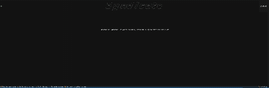
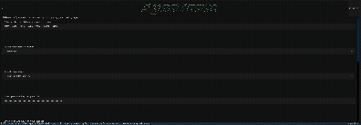
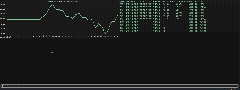

<div style="text-align: center;" markdown="1">

<pre>
   _____                        __    _                   __
  / ___/   __  __   ____   ____/ /   (_)  _____  ____ _  / /_  ___
  \__ \   / / / /  / __ \ / __  /   / /  / ___/ / __ `/ / __/ / _ \
 ___/ /  / /_/ /  / / / // /_/ /   / /  / /__  / /_/ / / /_  /  __/
/____/   \__, /  /_/ /_/ \__,_/   /_/   \___/  \__,_/  \__/  \___/
        /____/
</pre>

</div>

Syndicate is an AI-powered stock trading agent with a built-in integration with [Alpaca's](https://alpaca.markets/) brokerage API. It allows you to automatically monitor and trade a customizable watchlist of tickers with minimal manual intervention. The system is designed to combine multiple forms of analysis into a single, cohesive decision-making pipeline. It includes:

* A **news analyst** that reads and summarizes recent news affecting your assets.
* A **fundamental analyst** that evaluates company financials and balance sheets.
* A **technical analyst** that interprets indicators and price action.
* A **trader** that executes buy/sell decisions based on the combined recommendations of the analysts, while respecting deterministic guardrails defined by the user.

The package is open source and freely available via PyPI or this repository. However, it follows a bring-your-own-keys model: you will need active API credentials for both market data and an LLM provider to run it. Currently supported model providers include Anthropic, Google, OpenAI, Qwen, and Moonshot.

Syndicate also ships with a terminal user interface (TUI), making setup, configuration, and monitoring straightforward and intuitive—even for first-time users.

## Prerequisites
Syndicate relies on a few external services to function properly:

* A brokerage account with [Alpaca](https://alpaca.markets/) (for trading, account data, news, and real-time quotes)
* An API key from [Alpha Vantage](https://www.alphavantage.co/support/) (for technical indicators and supplementary market data)
* API access to at least one supported LLM provider

You can sign up for Alpaca and Alpha Vantage and obtain free API keys using the links provided in this document. Most users can get started entirely on free tiers.

## Installation

You can install the package from pypi just as you would any other:

```bash
pip install syndicate
```

or, download the build artifacts from this repo:

```bash
pip install git+https://github.com/mskmay66/syndicate@alpha
```

## Setup

Configuring your syndicate agen is easy, simply open a terminal and run:

```bash
syndicate
```

You will then be confronted with the TUI which should look something like this:



From there simply press the `s` key to toggle to the setup screen. This is what you should see (minus my setup, yours should be blank)



From here just follow the prompts from the TUI to fill things out, if you are confused about what anything means, read on and it will be explained.

## How to Configure your Agent

There are lot of choices you need to make when you first confiure your agent, let's go through them one by one.

### 1. What stocks do you want to follow?

Choose the tickers you want the agent to monitor and trade. This can be a focused list (e.g., a few tech stocks) or a broader portfolio. Keep in mind that more tickers = more API usage and potentially higher LLM costs.

### 2. What model do you want to use?

If you already have access to a supported provider, this may be an easy choice. Otherwise, consider:

* **Performance:** Some models are better at reasoning over financial data.
* **Cost**: Pricing varies significantly between providers.
* **Latency**: Faster models may be preferable for frequent trading cycles.

For a deeper comparison, see this paper:
👉 https://arxiv.org/html/2510.02209v1

**TLDR**: Models like Qwen and Kimi tend to perform well for structured reasoning tasks, but the “best” choice depends on your priorities (cost vs performance).

### 3. How do I get all these keys?

#### 📊 Alpha Vantage API Key (Market Data)
1. Go to the Alpha Vantage signup page:
👉 https://www.alphavantage.co/support/#api-key
2. Enter your email and request a free API key.
3. Your key will be shown immediately and also sent to your email.

**Notes:**
* Free tier includes rate limits (typically 5 requests/minute, 500/day).
* No credit card required.
* Provides technical indicators, time series data, and more

#### 📈 Alpaca API Keys (Trading)

1. Create an account at Alpaca:
👉 https://app.alpaca.markets/signup
2. After signing in, navigate to the API Keys section:
👉 https://app.alpaca.markets/paper/dashboard/overview

**Notes:**
* Use Paper Trading mode for testing (no real money).

### Configuring Guardrails

These settings control how your agent behaves in live markets and are critical for managing risk.

* **Execution Frequency:**
  Determines how often the agent runs. Syndicate creates a background cron job for you.
  * Use preset intervals (e.g., hourly, daily), or
  * Select `Custom` to provide your own cron expression.
* **Position Concentration:**
    Limits how much of your portfolio can be allocated to a single asset.
* **Stop Loss (%):**
    Defines the maximum acceptable loss per position before exiting.
* **Take Profit (%):**
    Specifies when gains should be locked in automatically.

These controls ensure that, regardless of model output, trading behavior stays within predictable and user-defined risk bounds.

### Paper Trading

[Alpaca](https://alpaca.markets/) supports paper trading, allowing you to test strategies without risking real money.

You can enable this via the toggle at the bottom of the setup screen. This is highly recommended when:

First configuring your agent
Testing new strategies or guardrails
Evaluating different models

## Changing Settings

To update your configuration:

1. Return to the setup screen (s)
2. Modify any fields
3. Press `f` to save and apply changes

Your previous settings will be preloaded for convenience.

## Tracking Your Agent

To keep up with what your agent is doing, you can open the TUI's main screen. Here you can see your portfolio's performance, your recent transactions, and you can ask your trading team questions via an LLM chatbot. Here's what it should look like:



## TradingAgents

The agent framework used in this project is inspired by the excellent [TradingAgents](https://github.com/tauricresearch/tradingagents) repository.

Syndicate extends this work by adding automated trade execution, enabling a fully end-to-end pipeline from analysis → decision → execution. If you’re interested in the analysis side without automated trading, that project is worth exploring.
